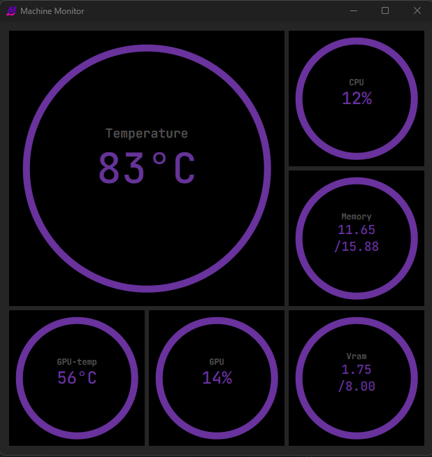

# Machine Monitor

View temperature and other information about the current machine.
Only Windows is supported

(Network, GPU and Battery are just placeholders)

## Back-end
Much of the back-end is handled by my qmstats crate which can be found at: https://github.com/AlbinDalbert/qmstats
