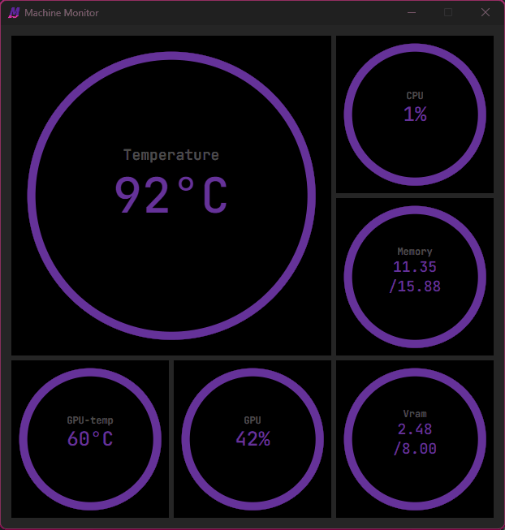

# Machine Monitor

Executable binary and installation (.msi) exist in releases --->

View temperature and other information about the current machine.

Only Windows is supported and Nvidia for graphics information



## Summary

### Front-End
This program is created using the Rust framework `Tauri` using a pure HTML, CSS, JS implementation.

### Back-End
The back-end uses multithreading. One thread executing all the communication with the Windows and NVidia APIs getting all data for the frontend. And the main rust thread taking the data from the APIs and sending it to the front-end.

Much of the back-end implementation is implemented in my rust crate `qmstats` which can be found at: https://github.com/AlbinDalbert/qmstats
## Compilation
This project is built with Tauri, to compile it follow the setup steps for tauri using `cargo` at https://tauri.app/.
To build a development build use the following command:

```$ cargo tauri dev```

To build a release build use the following:

```$ cargo tauri build```

## Known Problems
As mentioned above, atm the program only works on Windows and with Nvidia cards.
Yet, I have encountered problem with reading the temperature on a laptop. 
All other stats work, I think it's the WMI connection that doesn't really work.
Also, the handling of the WMI connection isn't great and needs to be looked at.
